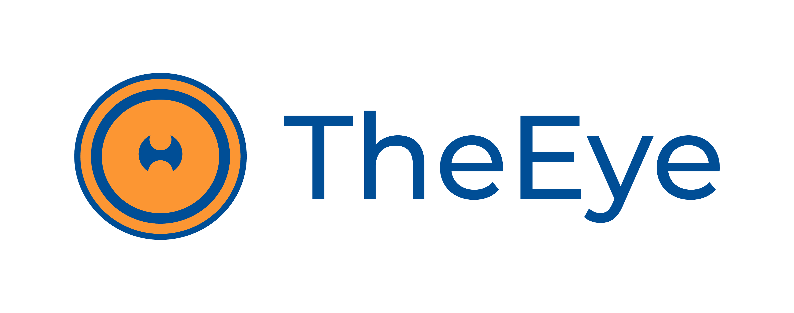

# API for Monitors

[](https://theeye.io/en/index.html)

## API URL for Monitors

URL: `https://supervisor.theeye.io/monitor?access_token={token}&customer={organization_name}`

| Method | Path           | Description                                           | ACL    |
| ------ | -------------- | ----------------------------------------------------- | ------ |
| GET    | /monitor       | [List monitors](#list-monitors)                       | viewer |
| GET    | /monitor       | [Search monitor by name](#search-monitor-by-name)     | viewer |
| GET    | /monitor       | [Show bot stats](#show-bot-stats)                     | viewer |
| DELETE | /monitor/${id} | [Delete Monitor](#delete-monitor)                     | admin  |
| POST   | /monitor       | [Create Web Check Monitor](#create-web-check-monitor) | admin  |
| GET    | /monitor/${id} | [Get Monitor by ID](#get-monitor-by-id)               | viewer |
| GET    | /monitor       | [Get Monitor by name](#get-monitor-by-name)           | viewer |

## Variables

`customer`: organization name

`access token`: menu => settings => credentials => Integration Tokens

## Examples

### List monitors

```bash
customer=$(echo $THEEYE_ORGANIZATION_NAME | jq -r '.')
token=$THEEYE_ACCESS_TOKEN

 curl -sS "https://supervisor.theeye.io/monitor?access_token=${token}&customer=${customer}"
```

### Search monitor by name

```bash
  customer=$(echo $THEEYE_ORGANIZATION_NAME | jq -r '.')
  token=$THEEYE_ACCESS_TOKEN
  monName=$1

  curl -sS "https://supervisor.theeye.io/monitor?access_token=${token}&customer=${customer}" | \
		jq -r --arg name "${monName}" '.[] | select(.name==$name) | {"name": .name, "id": .id, "state": .resource.state}' | jq -s '.'
```

### Show bot stats

```bash
  customer=$(echo $THEEYE_ORGANIZATION_NAME | jq -r '.')
  token=$THEEYE_ACCESS_TOKEN
  botName=$1

  curl -sS "https://supervisor.theeye.io/monitor?access_token=${token}&customer=${customer}"  | \
  jq -r --arg name "${botName}" '.[] | select((.name==$name) and (.type=="dstat")) | {"name": .name, "id": .id, "stats": .resource.last_event.data}' | jq -s '.'
```

#### Response example

```json
[
  {
    "name": "demo",
    "id": "5bb755f42f78660012bdd9af",
    "stats": {
      "cpu": 3,
      "mem": 36.73548113271163,
      "cache": 4.689083037753453,
      "disk": [
        {
          "name": "xvda2",
          "value": 84.84461326890819
        }
      ]
    }
  }
]
```

### Delete Monitor

```bash

customer=$(echo $THEEYE_ORGANIZATION_NAME | jq -r '.')
token=$THEEYE_ACCESS_TOKEN
id_monitor=$1

curl -X DELETE "https://supervisor.theeye.io/monitor/${id_monitor}?access_token=${token}&customer=${customer}"
```

### Create Web Check Monitor

```bash
customer=$(echo $THEEYE_ORGANIZATION_NAME | jq -r '.')
token=$THEEYE_ACCESS_TOKEN
host_id=$1
url=$2
monitorName=$3

curl -sS -X POST "https://supervisor.theeye.io/monitor?access_token=${token}&customer=${customer}&host_id=${host_id}" \
--header 'Content-Type: application/json' \
--data "{\"name\":\"${monitorName}\",\"host_id\":\"${host_id}\",\"url\":\"${url}\",\"timeout\":\"5000\",\"looptime\":\"15000\",\"type\":\"scraper\",\"status_code\":\"200\",\"_type\":\"ScraperMonitor\"}"
```

### Get Monitor by ID

```bash
customer=$(echo $THEEYE_ORGANIZATION_NAME | jq -r '.') token=$THEEYE_ACCESS_TOKEN
id_monitor=$1


curl -sS -X GET "https://supervisor.theeye.io/monitor/${id_monitor}?access_token=${token}&customer=${customer}"
```

### Get Monitor by name

```bash
customer=$(echo $THEEYE_ORGANIZATION_NAME | jq -r '.') 
token=$THEEYE_ACCESS_TOKEN
nameMonitor=$1


curl -sS -X GET "https://supervisor.theeye.io/monitor?access_token=${token}&where\[name\]=${nameMonitor}"
```
