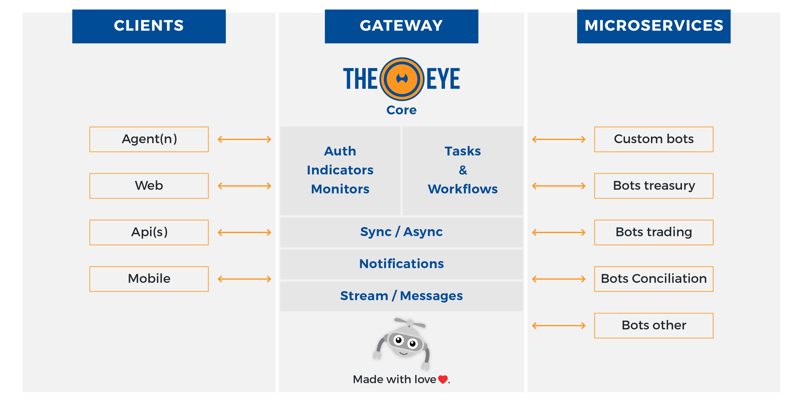

# TheEye Supervisor Core API

## What is TheEye?

<table>
  <tr>
    <td> </td>
    <td> TheEye is a process automation platform developed in NodeJS. Best used as BPM, Rapid Backoffice Development (RDA) and processes' hub.
Technically TheEye is a choreographer 
    </td>
  </tr> 
</table>

  

    

      <table>
        <th></th>
        <th></th>
        <th></th>
        <th></th>
        <th></th>
        <th></th>
      </table>
    

  

## Architecture

You can find more details about the Architecture of TheEye in the comprehensive [Documentation](https://documentation.theeye.io/theeye-supervisor/#/)

## Environment settings

Check the [quickstart](https://documentation.theeye.io/#/?id=install-all-theeye-components-on-a-single-machine) for a basic guided setup.

In the quickstart scripts and docker-compose you will find all the settings pre-defined to work locally.

You can play with it and try a different variation that fits your requirements. Pleas contact us if you need any further assistance or information.

### Predefined environment configuration

Basic configuration

| Name | Usage | Default |
| ----- | ----- | ----- |
| PORT | change rest api port. | 60080 |
| NODE_ENV | choose the configuration file that should be used. | undefined |
| DEBUG | enabled/disable the debug module. check npm debug module for more information | undefined |
| THEEYE_NODE_HOSTNAME | This key extends the debug module adding the hostname to logger output. tt is also handy to identify the docker containers logs using a hostname | undefined |
| VERSION | The current api version. If not provided will the programm will try to detected the version using git. This value could also be set using the configuration file default.js | undefined |
| CONFIG_NOTIFICATIONS_API_URL | Target notification system url. This could also be set using the configuration file default.js | undefined |

Core components control. Can be configured to do one o more things (or nothing). All the components are activated by default

| Variable Name | Usage | Default |
| ----- | ----- | ----- |
| COMMANDER_DISABLED | disable internal commander api | false |
| MONITORING_DISABLED | disable monitoring system. system monitors will not be checked anymore. will only change when bots and agents send updates | false |
| API_DISABLED | disable rest api | false |
| SCHEDULER_JOBS_DISABLED | disable internal scheduler execution. scheduler-jobs will be created using the rest api but task will never be executed. theeye-jobs execution timeout will be never checked. | false |

### Start development sample

`DEBUG=*eye* NODE_ENV=localdev MONITORING_DISABLED= SCHEDULER_JOBS_DISABLED= npx nodemon --inspect $PWD/core/main.js`
