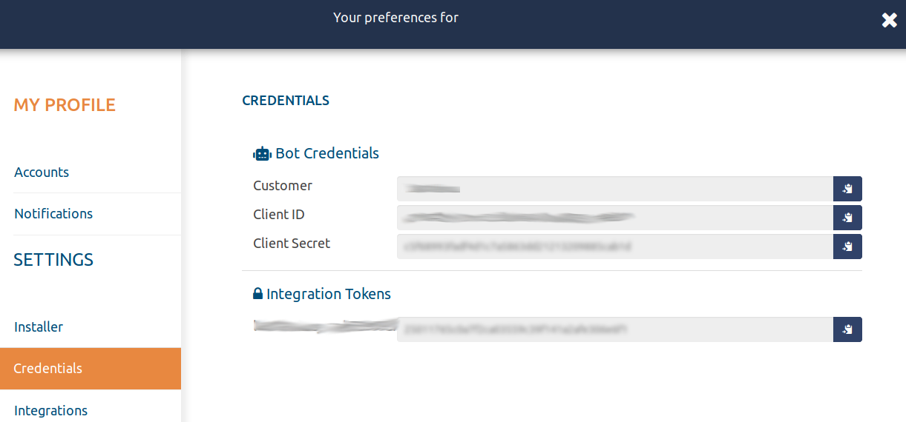

# Integration through API

-----

## Accessing the API

* Integration Tokens

* Basic Authentication & Bearer Authentication

* Secret Token

-----

### Integration Tokens

An Access Token is a credential that can be used by an application to access an API. Access Tokens can be either an opaque string or a JSON web token. They inform the API that the bearer of the token has been authorized to access the API and perform specific actions specified by the scope that has been granted.

To verify that access to the APIs has been enabled:
- Log in to TheEye Administration Console.
- You must use an administrator account.
  - On the main page of the administration console, go to setting then to credentials. You can see the list of "Integration Tokens".

-----

### Basic Authentication & Bearer Authentication

-----

### Access resources with Secret Token
